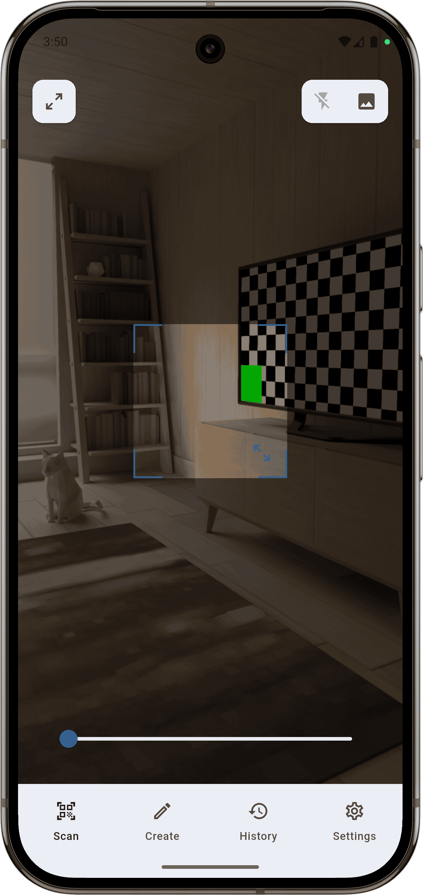
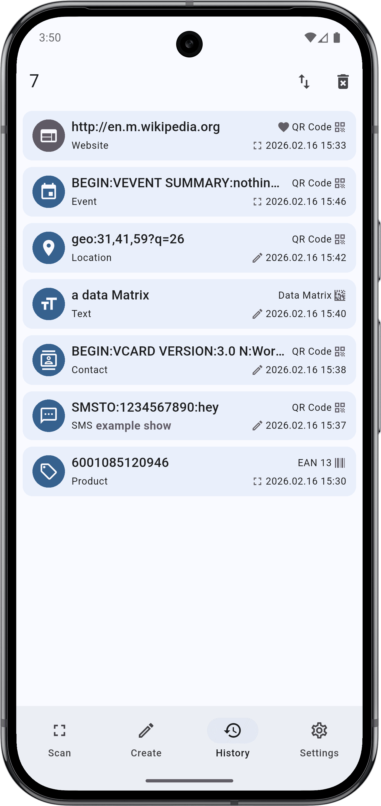
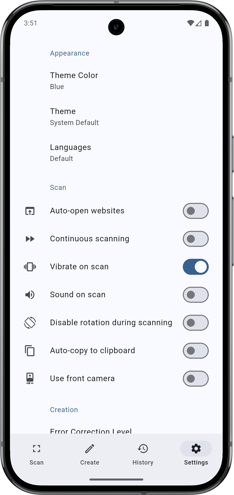
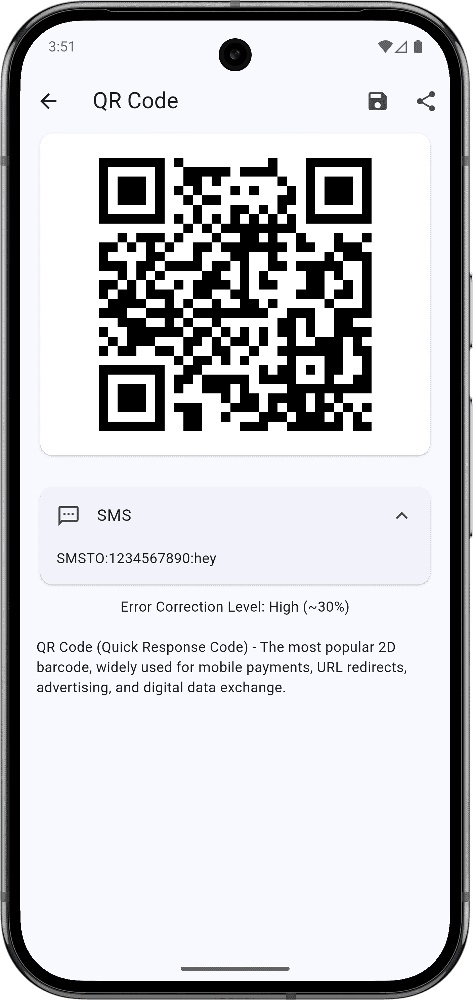
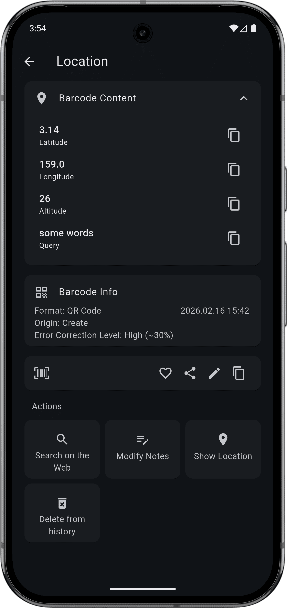
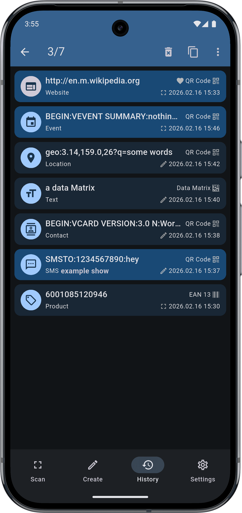

<p align="center"></p>
<h2 align="center">Watashi QR</h2>
<h4 align="center">A Flutter app for Android and iOS that can read and create barcodes.</h4>

<p align="center">
<a href="LICENSE"></a>
<a href="https://github.com/oniyukai/watashi_qr"></a>
</p>

Watashi QR is a Flutter application that reads and creates 1D/2D barcodes. It ships with a full-featured camera scanner, a generator for common QR content types and barcode formats, a local history with favorites and notes, and contextual actions for the content you scan. Everything runs on-device: there are no ads, no accounts and no telemetry.

## Screenshots

<table style="width: 100%;">
  <tr>
    <td></td>
    <td></td>
    <td></td>
    <td></td>
  </tr>
  <tr>
    <td></td>
    <td></td>
    <td></td>
    <td></td>
  </tr>
</table>

## Features

### Scanner

- Live camera scanning with a resizable scan window.
- Zoom slider and flashlight toggle.
- Optional vibration, a short beep tone, automatic copy-to-clipboard, continuous scan mode, auto-open website, and orientation lock.
- Scan a barcode from an image in the gallery.

### Creator

- QR content types: Text, Website, Contact, Email, SMS, Phone, Location, Event, and Wi-Fi.
- Barcode formats: QR Code, Data Matrix, Aztec, PDF417, EAN-13, EAN-8, UPC-A, UPC-E, Code 128, Code 93, Code 39, Codabar, and ITF.
- Per-format validation with helpful messages.
- Create a QR code from the clipboard.

### History & Analysis

- Favorites and notes per entry, plus stored metadata.
- Export / Import / Share the entire history as JSON.
- Content analysis with contextual actions.
- Render the barcode and export it as PNG, JPG, or SVG, or share it directly.

### Highlights

- **Appearance**: Material 3 UI with Material You dynamic color support (Android 12+) and a set of built-in color schemes.
- **Theme modes**: system, light, or dark.
- **Localization**: English, Japanese (日本語), Simplified Chinese (简体中文), and Traditional Chinese (繁體中文).
- **Privacy and ad-free**: No ads and no tracking; all data stays under the user's control and is not used for commercial purposes.

## License

<details>
<summary>GNU General Public License v3.0</summary>

```text
Copyright (C) 2025  ONIYUKAI https://github.com/oniyukai/watashi_qr

This program is free software: you can redistribute it and/or modify
it under the terms of the GNU General Public License as published by
the Free Software Foundation, either version 3 of the License, or
(at your option) any later version.

This program is distributed in the hope that it will be useful,
but WITHOUT ANY WARRANTY; without even the implied warranty of
MERCHANTABILITY or FITNESS FOR A PARTICULAR PURPOSE.  See the
GNU General Public License for more details.

You should have received a copy of the GNU General Public License
along with this program.  If not, see <https://www.gnu.org/licenses/>.
```
</details>

## Acknowledgements

- Thanks to [いらすとや](https://www.irasutoya.com/). This project icon uses material from いらすとや.
- Thanks to [BarcodeScanner](https://gitlab.com/Atharok/BarcodeScanner). The Inspiration of this project.
