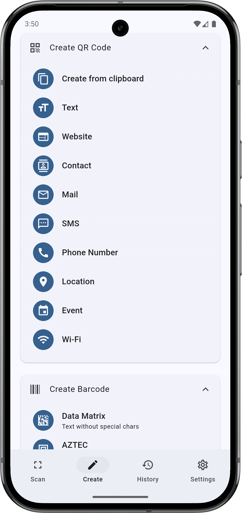
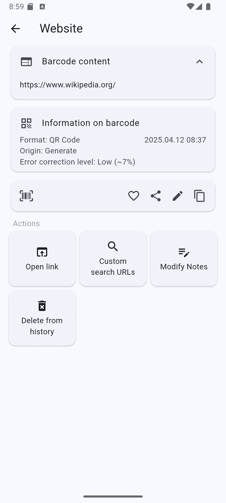
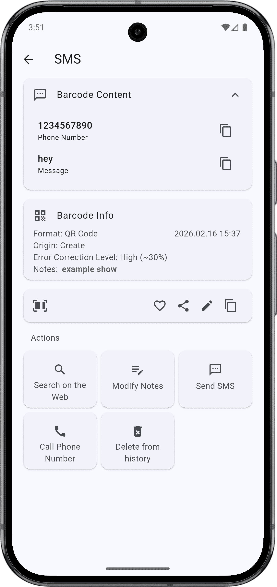
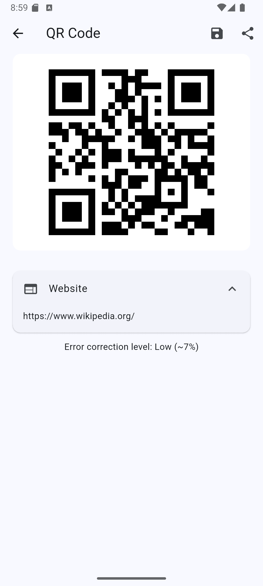

<h2 align="center">Watashi QR</h2>

<h4 align="center">An open-source Flutter app that allows you to read and generate barcodes for Android and iOS.</h4>

## Formats

Different barcode formats are supported:

- 2D barcode format: ***QR Code, Data Matrix, PDF 417, AZTEC***
- 1D barcode format: ***EAN 13, EAN 8, UPC A, UPC E, Code 128, Code 93, Code 39, Codabar, ITF***

## Features

- [x] Simply point the camera of your smartphone at the barcode and you will receive the information immediately. You can also scan the barcode from a picture in your smartphone.
- [x] Scanning frame with adjustable width and length.
- [x] Support continuous scanning, automatic website opening, front and rear camera selection.
- [x] With a simple scan, you can read business cards, open URLs, (todo: add a contact, add an event to the calendar).
- [x] Generate your own barcodes.
- [x] Keep track of all scanned barcodes with the history tool.
- [x] History favorites and item notes.
- [x] Customize the interface with different colors, light themes or dark themes. The interface is built with Material 3 and is compatible with Material You, which adjusts the colors to the wallpaper of devices running Android 12 or later.
- [x] Texts are translated into English, Japanese and Chinese (Traditional and Simplified).

## Screenshots

<table>
  <tr>
    <td></td>
    <td></td>
    <td></td>
    <td></td>
  </tr>
  <tr>
    <td></td>
    <td></td>
    <td></td>
    <td></td>
  </tr>
</table>

## Donate

If you like Watashi QR, you can support me via [Liberapay](https://liberapay.com/yukai/).

## Licences

The project is licensed under the [GNU General Public License v3.0](https://www.gnu.org/licenses/gpl-3.0).

## Acknowledgements

Thanks to [いらすとや](https://www.irasutoya.com/). This project icon uses material from いらすとや.

Thanks to [BarcodeScanner](https://gitlab.com/Atharok/BarcodeScanner). The Inspiration and languageKey of this project.